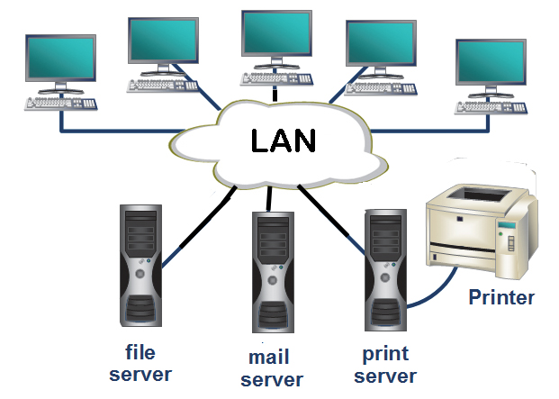
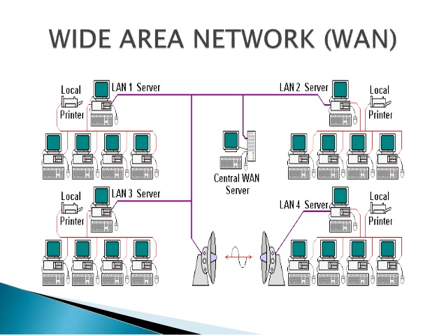
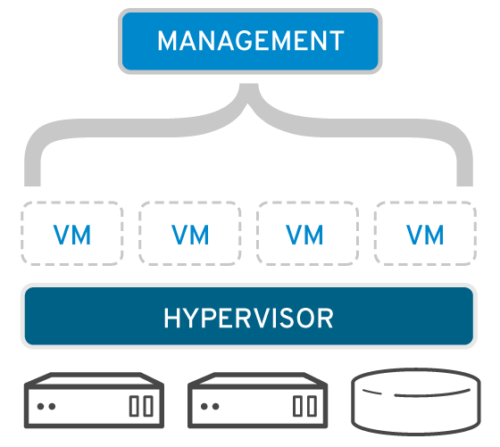

## What is a Network?

A network consists of two or more computers that are linked in order to share resources (such as printers and CDs), exchange files, or allow electronic communications.

## Type of network:

### LAN(Local Area Network)

A LAN connects network devices over a relatively short distance. A networked office building, school, or home usually contains a single LAN

### Wide Area Network

Wide Area Networks (WANs) connect networks in larger geographic areas, such as Florida, the United States, or the world. Dedicated transoceanic cabling or satellite uplinks may be used to connect this type of global network.

### what is virtualization ?

virtualization refers to the act of creating a virtual (rather than actual) version of something, including virtual computer hardware platforms, storage devices, and computer network resources.

### What is a hypervisor?

A hypervisor is a program for creating and running virtual machines.

### What is a virtual machine?

A virtual machine is a program that acts as a virtual computer. It runs on your current operating system – the “host” operating system – and provides virtual hardware to “guest” operating systems.

### How does virtualization work?

Software called hypervisors separate the physical resources from the virtual environments—the things that need those resources. Hypervisors can sit on top of an operating system (like on a laptop) or be installed directly onto hardware (like a server), which is how most enterprises virtualize. Hypervisors take your physical resources and divide them up so that virtual environments can use them.

# what is aws ?

aws is a cloud services platform,in which the services can be mixed and match to create any kind of infracture.

# Elastic Cloud Compute

* Elastic Compute Cloud (EC2) provides scalable computing capacity in the Amazon Web Services (AWS) cloud.
* EC2 eliminates the need to invest in hardware up front, so applications can be developed and deployed faster.
* EC2 can be used to launch as many or as few virtual servers as you need, configure security and networking, and manage storage.
* EC2 enables you to scale up or down to handle changes in requirements or spikes in popularity, reducing your need to forecast traffic.

# EC2 features
In aws Virtual computing environments, known as Ec2 instances

## AMI(Amazon Machine Images)
* Preconfigured templates for your instances, known as Amazon Machine Images (AMIs), that package the bits you need for your server (including the operating system and additional software)
* An Amazon Machine Image (AMI) is a special type of pre-configured operating system and virtual application software which is used to
create a virtual machine within the
Amazon Elastic Compute Cloud (EC2)

## Instance types
Various configurations of CPU, memory, storage, and networking capacity for your instances, known as Instance types

## key pairs
Secure login information for your instances using key pairs (AWS stores the public key, and you store the private key in a secure place)

## Amazon EBS
Storage volumes for temporary data that’s deleted when you stop or terminate your instance, known as Instance store volumes

## Instance store volumes
Persistent storage volumes for your data using Amazon Elastic Block Store (Amazon EBS), known as Amazon EBS volumes

## Regions and Availability Zones
Multiple physical locations for your resources, such as instances and Amazon EBS volumes, known as Regions and Availability Zones

## security groups
A firewall that enables you to specify the protocols, ports, and source IP ranges that can reach your instances using security groups

## Elastic IP addresses
Static IP addresses for dynamic cloud computing, known as Elastic IP addresses

## VPC
Virtual networks you can create that are logically isolated from the rest of the AWS cloud, and that you can optionally connect to your own network, known as Virtual private clouds (VPCs)

## Accessing EC2
### Amazon EC2 console
Amazon EC2 console is the web-based user interface which can be accessed from AWS management console
### AWS Command line Interface (CLI)
Provides commands for a broad set of AWS products, and is supported on Windows, Mac, and Linux.
### Amazon EC2 Command Line Interface (CLI) tools
Provides commands for Amazon EC2, Amazon EBS, and Amazon VPC, and is supported on Windows, Mac, and Linux
### AWS Query API
Query API allows for requests are HTTP or HTTPS requests that use the HTTP verbs GET or POST and a Query parameter named Action
### AWS SDK libraries
AWS provide libraries in various languages which provide basic functions that automate tasks such as cryptographically signing your requests, retrying requests, and handling error responses

### Security Groups
 
Security Groups are virtual firewalls that allow you to restrict access to EC2 instances on Protocol, Port Range, and Source IPs  
 
- One EC2 instance can be associated with 1 or more Security Groups.  
- There are 'Inbound' and 'Outbound' rules.  
- All Inbound traffic is Blocked by default
- All Outbound traffic is Allowed by default
- Security Groups are 'stateful' which means that any Inbound rule a mirror Outbound rule is added.  
- Outbound rules include Destination IP range in addtion to those in Inbound rules.  
- Cannot add 'deny' rules only allow.  
## Network Options 
 
- Automatically created Default VPC is default network
- One subnet equals one Availability Zone  
 ### SSH to instance
 
- Requires key pair for instances associated Security Group that allows SSH
- chmod 400 permissions set on key
- To login: ssh ec2-user@public_ip_address -i keyName.pem
 ### Status Checks
 
System Status - verify instance is reachable.  
Instance Status - verify instance reachable and instance is up at OS level. 
## EC2 Instance Types
 
   * D2 Dense Storage
   * R4 Memory Optimised
   * M4 General Purpose
   * C4 Compute Optimised
   * G2 Graphics Intensive
   * I2 High Speed Storage
   * F1 Field Programmable Gate Array
   * T2 Low Cost, General Purpose
   * P2 Graphics/General purpose GPU
   * X1 Memory Optimised 

## EBS
 
Elastic Block Storage  
 
- Storage volumes attached to EC2 instances
- Block based storage so can run applications
- Placed in specific Availability Zone
- Automatically replicated within Availabilty Zone to prevent single component failure
 
Root devices cannot be encrypted by standard but can be if you create own AMI and encrypt the root device when you create the AMI.  
 
Additional volumes can be encrypted.  
 
### Types
 
- General Purpose SSD (GP2)  10,000 IOPS
- Provisioned IOPS SSD (IO1) More than 10,000 IOPS
- Throughput Optimised HDD (ST1) Frequently accessed
- Cold HDD (SC1) Less frequently accessed
- Magnetic (Standard) Standard, cheap and infrequently accessed
 
Cold HDD and Throughput Optimised HDD cannot be attached to Root volume  
 
By default when deleting EC2 instance the attached EBS volumes will be deleted also as 'Delete on Termination' Termination Protection option checked by default.  
 
** You cannot mount 1 EBS volume to multiple EC2 instances, consider EFS **   
 
EBS volumes can be changed on the fly (except for magnetic standard).  
 
You can scale EBS Volumes up only.
Volumes must be in the same AZ as the EC2 instances
 

 

